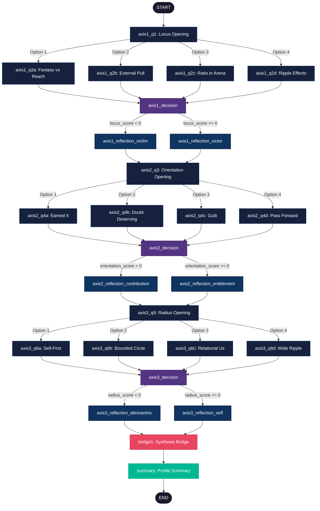

# Daily Reflection Tree - Visual Diagram

## Flow Diagram

## Node Inventory

| Node ID | Type | Axis | Description |
|---------|------|------|-------------|
| start | start | - | Entry point |
| axis1_q1 | question | Locus | Opening locus question |
| axis1_q2a | question | Locus | Follow-up for external option |
| axis1_q2b | question | Locus | Follow-up for mixed option |
| axis1_q2c | question | Locus | Follow-up for internal option |
| axis1_q2d | question | Locus | Follow-up for strong internal |
| axis1_decision | decision | Locus | Routes by locus_score |
| axis1_reflection_victim | reflection | Locus | External locus reflection |
| axis1_reflection_victor | reflection | Locus | Internal locus reflection |
| axis2_q3 | question | Orientation | Opening orientation question |
| axis2_q4a | question | Orientation | Follow-up for entitlement |
| axis2_q4b | question | Orientation | Follow-up for doubt |
| axis2_q4c | question | Orientation | Follow-up for guilt |
| axis2_q4d | question | Orientation | Follow-up for contribution |
| axis2_decision | decision | Orientation | Routes by orientation_score |
| axis2_reflection_entitlement | reflection | Orientation | Entitlement reflection |
| axis2_reflection_contribution | reflection | Orientation | Contribution reflection |
| axis3_q5 | question | Radius | Opening radius question |
| axis3_q6a | question | Radius | Follow-up for self-first |
| axis3_q6b | question | Radius | Follow-up for bounded circle |
| axis3_q6c | question | Radius | Follow-up for relational |
| axis3_q6d | question | Radius | Follow-up for expansive |
| axis3_decision | decision | Radius | Routes by radius_score |
| axis3_reflection_self | reflection | Radius | Self-centric reflection |
| axis3_reflection_altrocentric | reflection | Radius | Altrocentric reflection |
| bridge1 | bridge | - | Synthesis transition |
| summary | summary | - | Final profile with interpolation |
| end | end | - | Terminal node |

## Path Statistics

- **Total Nodes:** 28
- **Questions:** 13 (4+ per axis including opening)
- **Decision Nodes:** 3
- **Reflection Nodes:** 6
- **Bridge Nodes:** 1
- **Summary Nodes:** 1
- **Start/End Nodes:** 2

## Possible Paths

The tree supports 64 unique paths from start to end:
- 4 options at axis1_q1 × 4 options at each axis1_q2× = 16 paths to Axis 1 decision
- 2 branches from Axis 1 decision × 4 options at axis2_q3 × 4 options at each axis2_q4× = 32 paths to Axis 2 decision
- 2 branches from Axis 2 decision × 4 options at axis3_q5 × 4 options at each axis3_q6× = 64 total unique paths

Each path produces a unique combination of:
1. Locus orientation (victim/victor)
2. Orientation framing (entitlement/contribution)
3. Radius scope (self/altrocentric)

## Signal System

Each question node emits signals that accumulate:
- `axis`: Which axis (locus, orientation, radius)
- `direction`: Which pole (internal/external, entitlement/contribution, self/altrocentric)
- `magnitude`: Weight (-1, 0, 1, 2)

Decision nodes evaluate accumulated scores:
- `locus_score >= 0` → victor path
- `orientation_score >= 0` → entitlement path
- `radius_score >= 0` → self path
